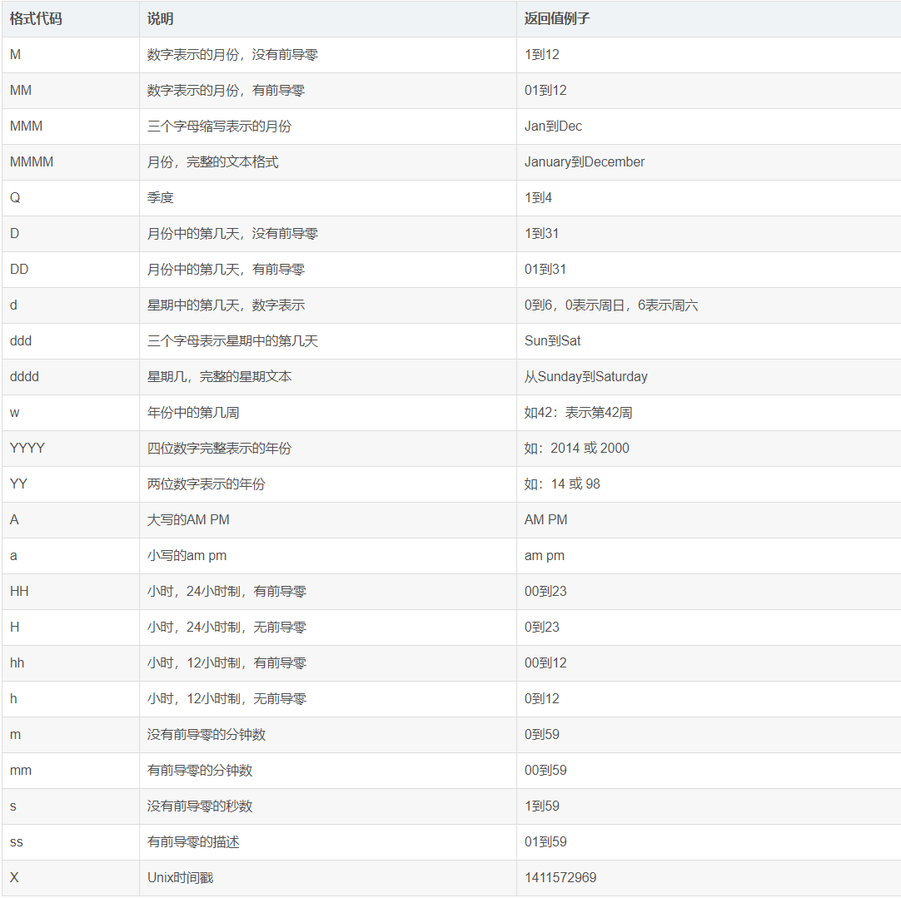

## moment 格式化时间

#### 安装 moment

```node
npm install moment
```

#### 引入 moment

```js
import moment from "moment";
```

#### 使用 moment

```js
// 直接使用
let startDate = moment("2022-05-06").format(YYYY - MM - DD);

// 封装函数使用
/**
 * @description: 根据指定格式返回日期时间
 * @param {String} dateStr 日期字符串。例如：2022-06-27 16:33:38
 * @param {String} patten 需要转换的格式。例如："YYYY年MM月DD日 HH:mm:ss"
 * @return {String} 返回指定格式的日期时间 如：2022年06月27日 16:33:38
 */
export function formatDate(dateStr, patten) {
  return moment(dateStr).format(patten);
}
```

#### moment 参数说明


