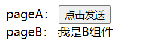
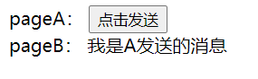

# vue 传值之中央事件总线（EventBus）

在 vue 中，我们父子之间通信简单明了：

父组件向子组件传值： props，

在父组件中，用 ：要传递过去的名字 = “ 要传递的值 ”。

在子组件中 使用 props:{}接受即可

子组件向父组件传值：\$emit. 通过自定义方法，

在子组件中，我们使用 this.\$emit('方法名'，参数)，向父组件传值

在父组件中，我们使用子组件传递过来的自定义方法 ： @自定义方法名 = “ 自己随便写一个方法名，不需要跟参数，在下面使用该方法时，再写到（）中 ”

以上，是关于 vue 中父子组件通信的方法，

那么非父子组件之间的通信，又是怎么样的呢？

其实也很简单，有两种方法：

1.通过 Vuex, Vuex 中的 state.是可以共用的属性。通过调用 Vue.state 就可以获取到，非父子组件之间通信就可以解决

2.通过\$bus, 事件总线

##### 1、创建中央事件总线

首先呢。我们需要去在 `main.js` 中创建 bus

```JavaScript
// 全局事件总线
Vue.prototype.Bus = new Vue();
// Vue.prototype.$bus = new Vue()

// 特别注意：$emit 和 $on 的事件必须在一个公共的实例上
```

##### 2、使用中央事件总线传值

在 `pageA` 页面传值

然后，我们就可以使用 this.$bus.$emit(’事件名称‘，参数) 发送

```vue
<template>
    <div>
        pageA：
        <button @click="change">点击发送</button>
    </div>
</template>

<script>
export default {
    data() {
        return {
            msg: "我是A发送的消息",
        };
    },
    methods: {
        change() {
            // this.$emit（'自定义事件名',要传送的数据）；
            // 触发当前实例上的事件，要传递的数据会传给监听器；
            this.Bus.$emit("sendMsg", this.msg); // sendMsg:自定义事件名,this.msg:要传送的数据
            // this.$bus.$emit("test", res);
        },
    },
};
</script>
```

##### 3、接收值

最后，我们可以通过 this.$bus.$on('事件名称',function(参数){}) 接收

```vue
<template>
    <div>pageB： {{ message }}</div>
</template>

<script>
export default {
    data() {
        return {
            message: "我是B组件",
        };
    },
    mounted() {
        // VM.$on('事件名',callback) ---callback回调$emit要传送的数据；
        // 监听当前实例上自定义事件；
        this.Bus.$on("sendMsg", (msg) => {
            // sendMsg:监听的自定义事件名; msg: 传送过来数据的回调
            this.message = msg;
        });
        // this.$bus.$on("test", (message) => {
        //     this.projectArr.unshift(message.data);
        // });
    },
};
</script>

<style scoped lang="scss"></style>
```

这样。我们就可以通过事件总线获取到非父子组件通信

##### 4、效果

-   1、点击前



-   2、点击后


